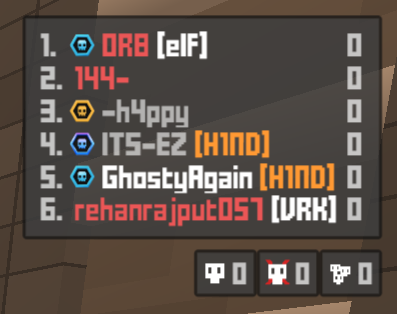
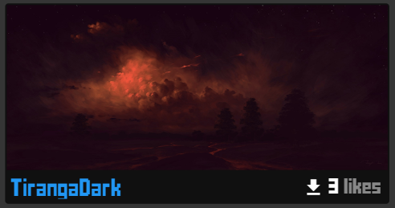
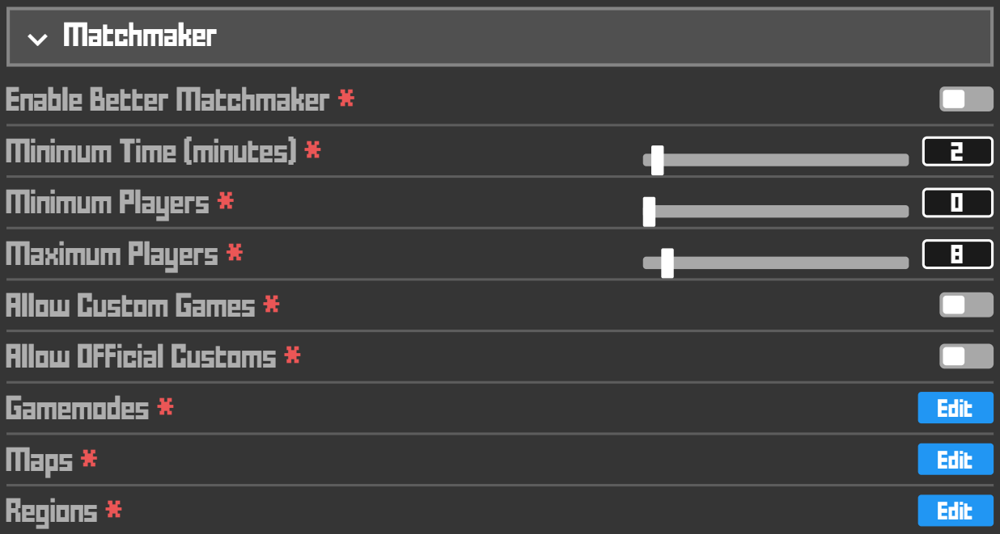
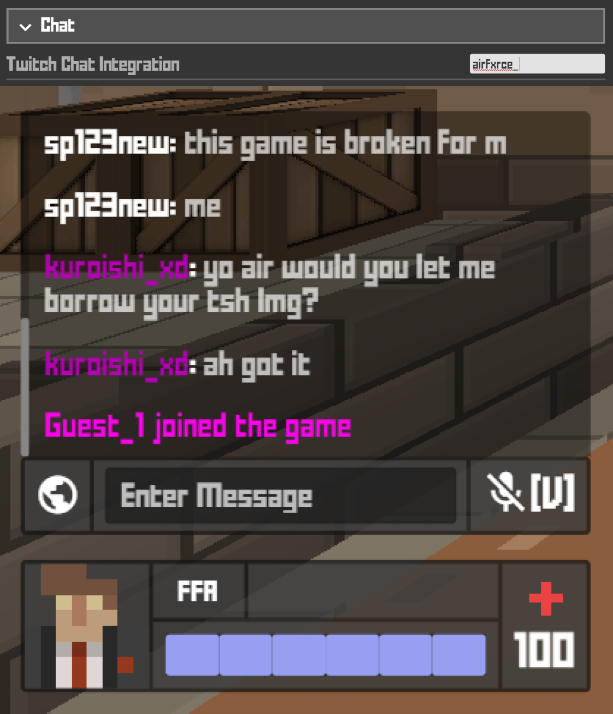
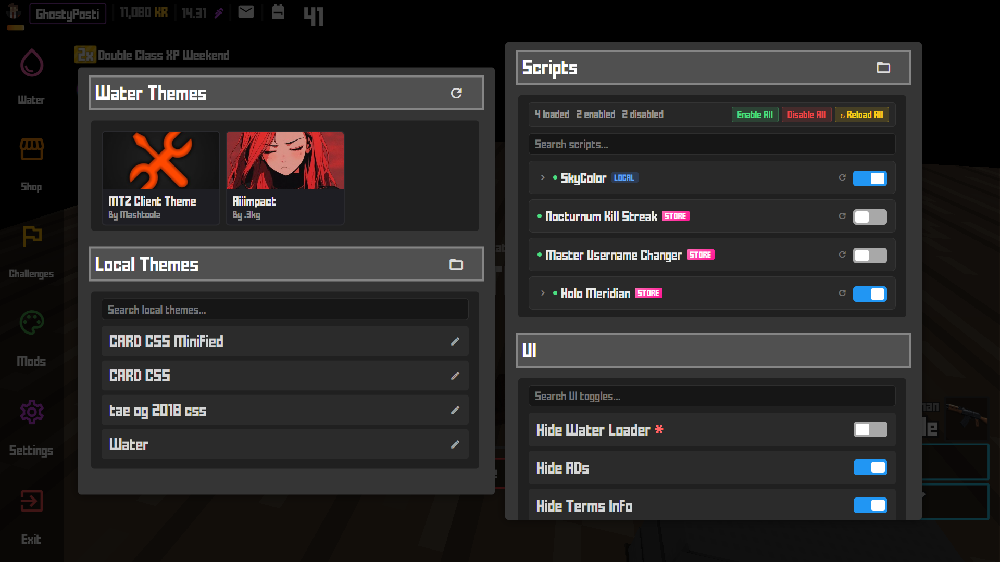
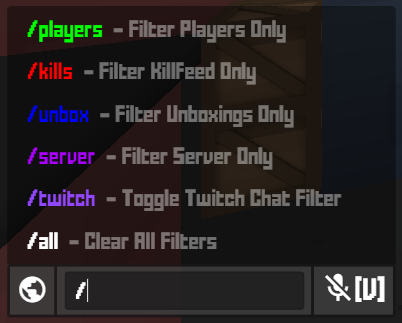

# Fresh Water Available.

This client aims for:
- Stable behavior and performance
- Advanced customizability (settings and userscripts)
- Constructive to the community (open source; under [AGPL-3.0](https://github.com/Water-client/Water/blob/master/LICENSE))

## Best Features

### Water Store
Link your Discord with Water Client through Water Bot
- Convert your KR into Pani by sending it to "GhostyPosti"
- Pani can be used to buy Custom CSS Themes from the Water Store
- View your Pani balance directly from Discord using Water Bot

### Better Matchmaker (F4)
Press **F4** to instantly join a random public game with complete customization:
- Filter by **player count** (min/max)
- Filter by **game modes** (FFA, TDM, CTF, etc.)
- Filter by **server regions** (MBI, TOK, FRA, etc.)
- Filter by **remaining time**
- **Force current region** option

### Twitch Chat Integration
Display **Twitch stream chat** directly in Krunker's in-game chat:
- Real-time IRC WebSocket connection
- **Purple usernames** (#B500B5) for easy distinction
- **Auto-reconnect** on disconnect
- **Duplicate message filtering** (last 50 messages)
- Configure via **Client Settings → Chat**

### Water Customizations
Custom theme and UI toggle system:
- **15 UI toggles**: Hide ADs, Terms Info, Signup Alerts, Hide Buttons in menuItemContainer, etc.
- **Community CSS themes** support
- **Scripts section** for custom functionality

### Performance Optimizations
- **Lightweight DevTools** (F12) - Opens in detached mode for minimal impact
- **Uncapped FPS** support
- **ANGLE Graphics Backend** selection
- **Accelerated Canvas** option
- **In-Process GPU** mode

### Advanced Settings
- **Discord Rich Presence**
- **Auto-Update** behavior control
- **Userscripts** support
- **Resource Swapper** (Normal/Advanced modes)
- **Chromium Flags** customization
- **Display Mode** options (Windowed/Maximized/Fullscreen/Borderless)

## Screenshots

### Rank Badges on Old Scoreboard

### One-Click Mod Downloader

### Quick Play Feature

### Twitch Chat Integration

### Water Customizations Window

### Chat Filters

---

## Supported Platforms

| Platform | File Type   |
|---------|------------|
| Windows | `.exe`     |
| macOS   | `.dmg`     |
| Linux   | `.AppImage`|
